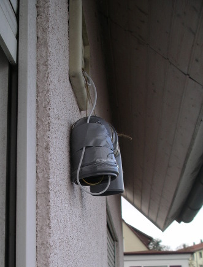

# meta
Opendata Stuttgart organisiert und reguliert.

Bitte [Issues](https://github.com/opendata-stuttgart/meta/issues)  und [Wiki](https://github.com/opendata-stuttgart/meta/wiki) benutzen.

IRC: #opendata-stuttgart (auf freenode)

