# Station bauen{.allowframebreaks}

Diese Anleitung erläutert den Zusammenbau einer Feinstaubmesstation, wie sie im OK-Lab Stuttgart entwickelt wurde *(Dokumentversion: 2016-11-11)*.

## Einzelteile, die benötigt werden{.allowframebreaks}

|Abbildung|Bauteil|
|-----------------------------------------------:|:-----------------------------------------|
|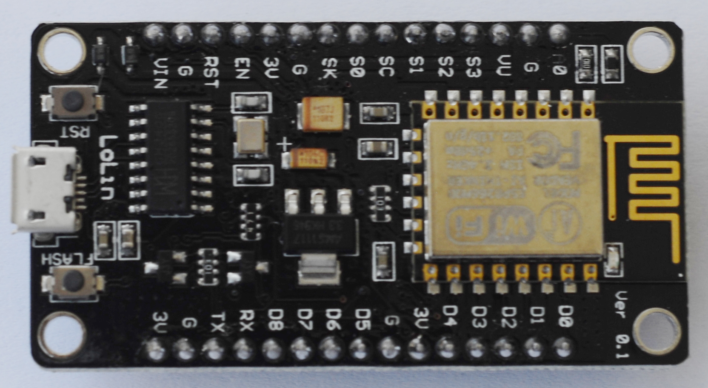{width=13%} <!--  * PPD42NS (Feinstaubsensor)   -->|ESP8266 (WLAN, Prozessor für Datenspeicherung)|
|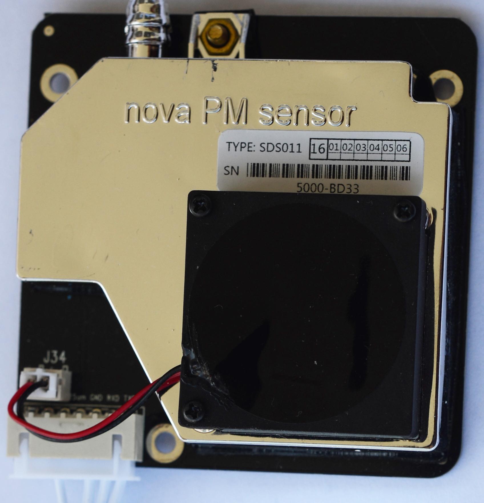{width=25%}|SDS011 (Feinstaubsensor), ersetzt PPD42NS|
|<!-- 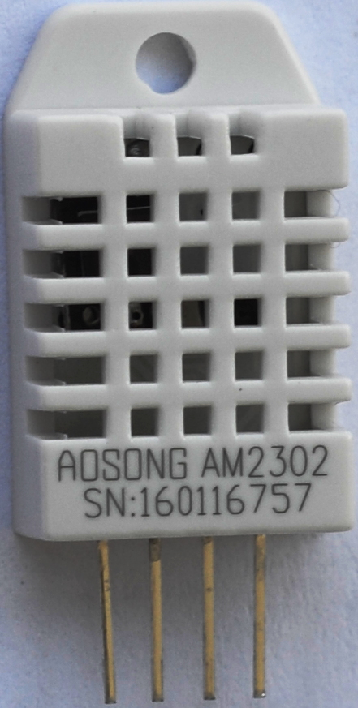{width=19%} -->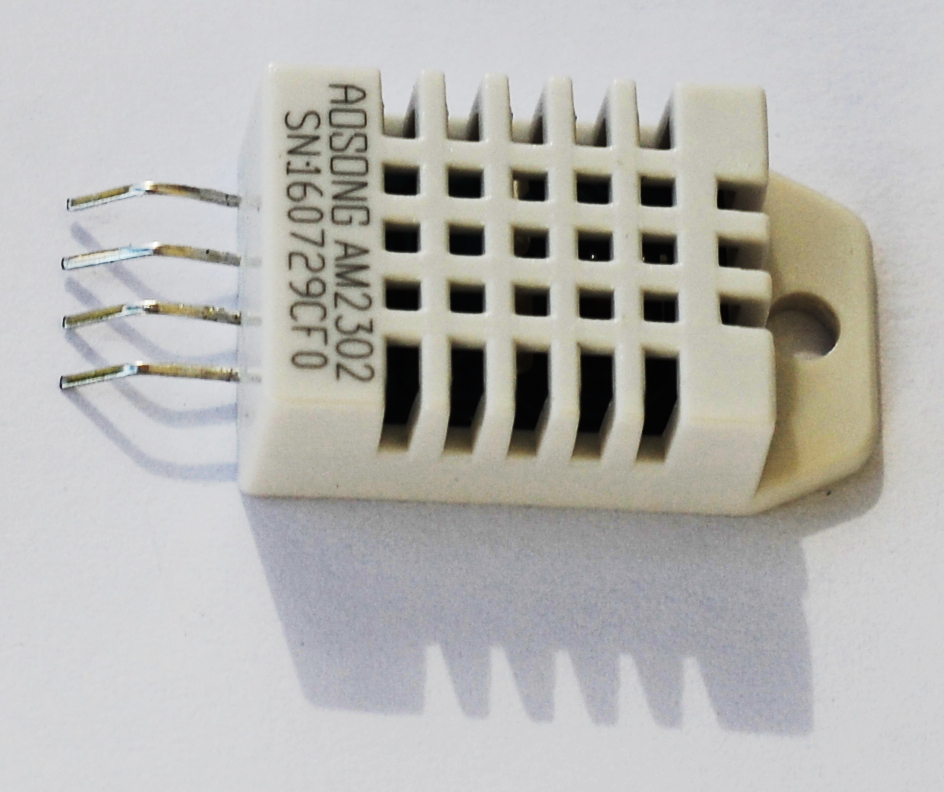{width=9%}|DHT22 (Sensor für Temperatur & Luftfeuchtigkeit)|
|<!-- 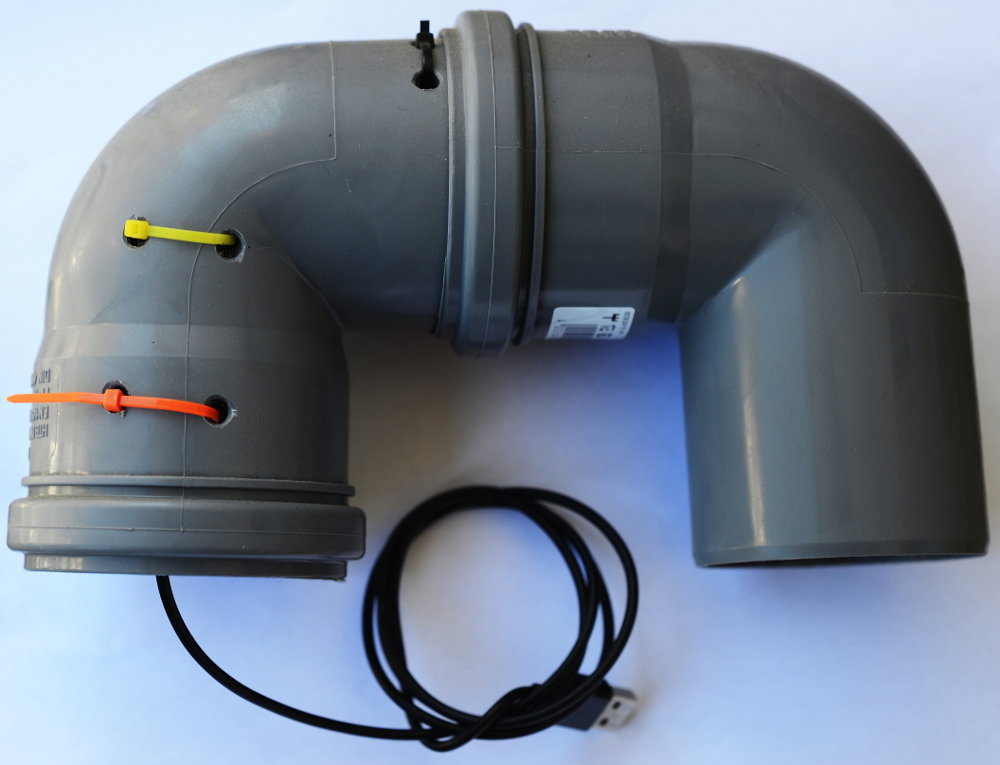{width=49%} -->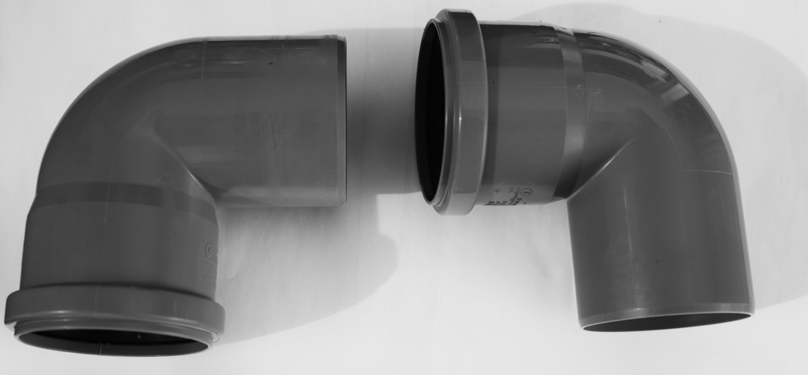{width=29%}|Abflussröhren zur Außenmontage (Schutzhülle)|
|<!-- 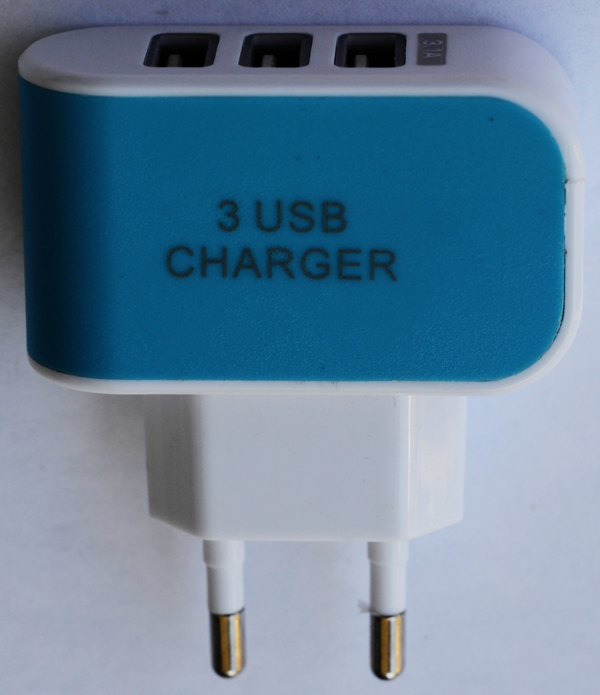{width=49%} -->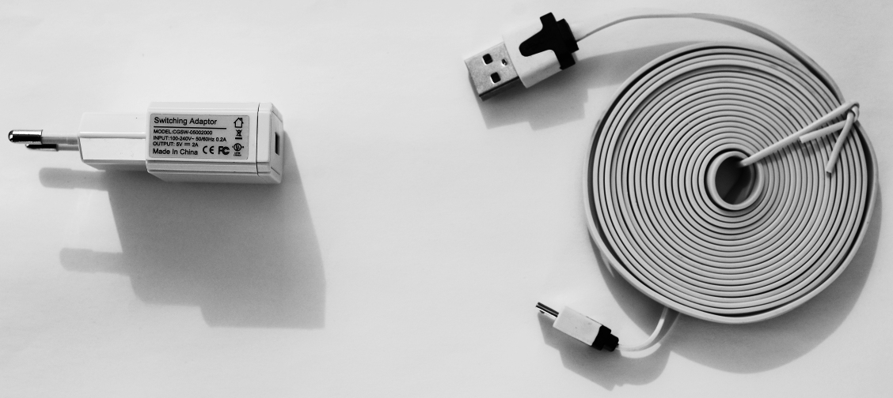{width=19%}|Stromversorgung (MicroUSB-Kabel + Netzteil)|
|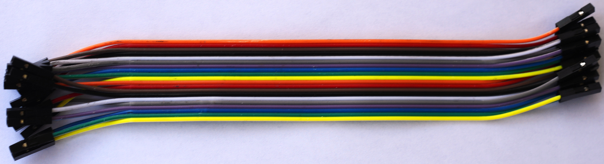{width=29%}|Kleinkram (Kabel 7x w-w, evtl. 1x m-m, 2x Kabelbinder)|

* Zugang zu Wifi-Netzwerk (ESSID + Passphrase), optional ein Freifunk-Router

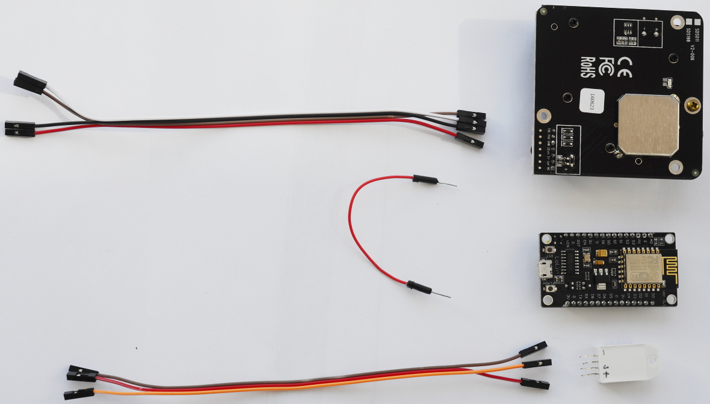

## Zusammenbau{.allowframebreaks}

Siehe Wiki unter [github.com/opendata-stuttgart/meta/wiki/Zusammenbau-der-Komponenten](https://github.com/opendata-stuttgart/meta/wiki/Zusammenbau-der-Komponenten)

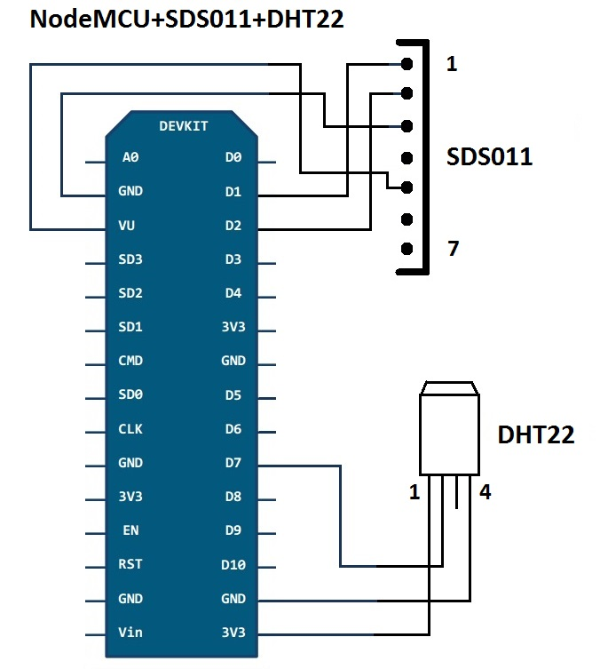{width=49%,angle=90}

<!-- Für die Montage der einzelnen Komponenten empfehlen sich Dupont-Kabel mit ca. 20 cm Länge (siehe Bestellliste). -->
WICHTIG: Bei Verwendung des SDS011 unbedingt **vor dem Zusammenbau die Firmware aufspielen!**
Es scheint so, als ob die "Original-Firmware" nach Auslieferung auf einen der Pins D1 oder D2 5V schaltet, die zur Beschädigung des SDS011 führen können.

<!-- --- -->

### Anschluss SDS011 an ESP {.allowframebreaks}

Pins sind von RECHTS nach LINKS nummeriert. Beim Verbinden darauf achten, dass die Kabel AUF den Pins stecken, da die meisten Dupont-Kabel auch "NEBEN" die Pins passen.

    SDS011 Pin 1 -> Pin D1 / GPIO5
    SDS011 Pin 2 -> Pin D2 / GPIO4
    SDS011 Pin 3 -> GND
    SDS011 Pin 4 -> unused
    SDS011 Pin 5 -> VU (NodeMCU v3) / VIN (NodeMCU v2)
    SDS011 Pin 6 -> unused
    SDS011 Pin 7 -> unused

<!-- --- -->

### Anschluss des DHT22 an ESP {.allowframebreaks}

Pins sind von LINKS nach RECHTS nummeriert; Vorderseite ist das "Gitter"

    DHT22 Pin 1 -> Pin 3V3 (3.3V)
    DHT22 Pin 2 -> Pin D7 (GPIO13)
    DHT22 Pin 3 -> unused
    DHT22 Pin 4 -> Pin GND

Optional, aber besser: DHT22-Pin1 (+) auch an 5V(VU an ESP), z.B. mit doppelt männlichem Dupont-Kabel auf VU Dupontbuchse hinten aufstecken (neben das Kabel, es ist eng und kann schwierig sein).

<!-- --- -->

### Einbau der Elektronik in Schutzhülle, bzw. Röhren{.allowframebreaks}

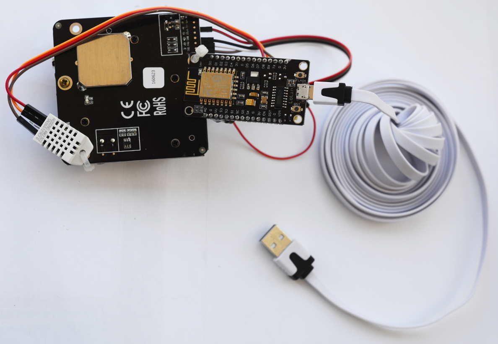{width=49%}
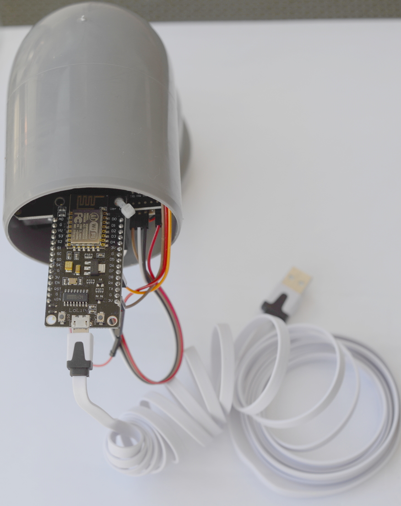{width=49%}

Vor dem Einbau die Nummer des Sensors auf die Röhren schreiben.
* Mit zwei Kabelbindern die Teile so zusammenbinden, dass sie genau in die Röhren passen, dabei Kabel nicht dazwischen quetschen
* Einbau so, dass der Lüfter des SDS unten ist und auf der Röhrenseite *ohne* Gummidichtung
* Röhre 2 über Elektronik schieben und auf Röhre 1 stecken, dabei USB-Kabel herausführen (siehe Foto Einzelteile)

## Konfiguration der Station{.allowframebreaks}

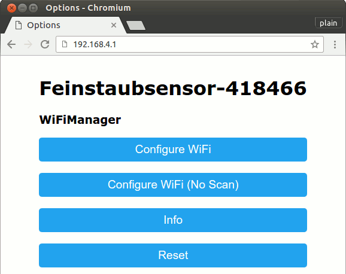{width=49%}

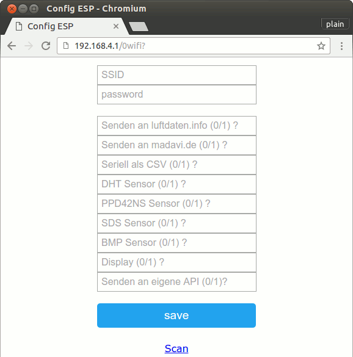{width=49%}

<-- 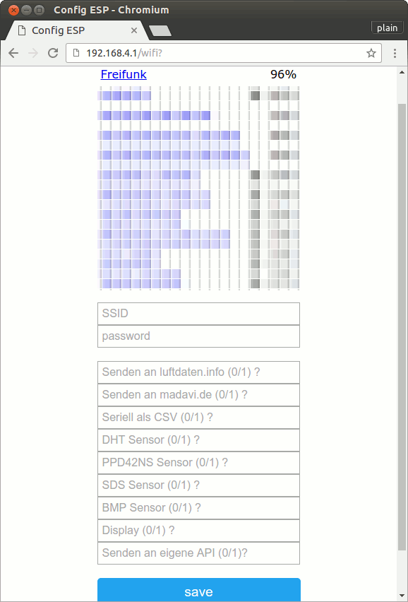{width=49%} -->

* Station einschalten (Stromkabel verbinden)
* Die Station versucht, sich auf den konfigurierten WLAN-Accesspoint zu verbinden
* Wenn das nicht klappt, öffnet der Sensor einen Accesspoint mit dem Namen *Feinstaubsensor-ID*, wobei ID die ChipID (in dezimal) ist.
    * Man verbinde sich mit diesem Wireless-Netzwerk
    * und rufe dann die Seite [http://192.168.4.1/](http://192.168.4.1/) auf, dort kann der Sensor konfiguriert werden
    
        *Achtung:* Der Sensor versucht beim Start eine Verbindung zum WLAN, wenn das nicht funktioniert (nach ca. 10-20 sec.), dann erzeugt er diesen WLAN-Accesspoint (Oft braucht der Rechner auch noch ein bisschen Zeit, bis er das Netz "bemerkt"). Die Konfiguration ist für 300 sec erreichbar, im Zweifel nur SSID und Passwort eintragen, ich hatte schon beim senden, dass der AP schon wieder weg war (Browser meldet Netzwerkfehler). Es gibt einen Reset-Knopf (RST) links neben der USB-Buchse zum Reboot.
    * unter *Configure Wifi* SSID und password des eigenen Netzes eintragen
        * *(0/1)?* bedeutet, dass 1 (=ja) oder 0 (=nein) eingetragen wird (1 für ja/vorhanden, 0 für nein/nicht_da)
        * sinnvolle Voreinstellungen sind (mit SDS011 und DHT Sensoren):

                1 "Senden an luftdaten.info (0/1) ?"
                1 "Senden an madavi.de (0/1) ?"
                0 "Seriell als CSV (0/1) ?"
                1 "DHT Sensor (0/1) ?"
                0 "PPD42NS Sensor (0/1) ?"
                1 "SDS Sensor (0/1) ?"
                0 "BMP Sensor (0/1) ?"
                1 "Auto-Update (0/1) ?"
                0 "Display (0/1) ?"
                3 "Debug output (0-5) ?"
                0 "Senden an eigene API (0/1)?"
    
        * *save*, dann sollte diese Seite erscheinen ansonsten noch einmal RST und von vorne
	
                Credentials Saved
                Trying to connect ESP to network.
                If it fails reconnect to AP to try again

	* die URL kann übrigens wiederverwendet werden, und sieht so aus (MYESSID MYPASSWORD anpassen):
	  [192.168.4.1/wifisave?s=MYESSID&p=MYPASSWORD&send2dusti=1&send2madavi=1&send2csv=0&dht_read=1&ppd_read=0&sds_read=1&bmp_read=0&auto_update=1&has_display=0&debug=3&%CC.%FF%3F%BC%94%FE%3F%CC%3B%FF%3F%0D%0A=0](http://192.168.4.1/wifisave?s=MYESSID&p=MYPASSWORD&send2dusti=1&send2madavi=1&send2csv=0&dht_read=1&ppd_read=0&sds_read=1&bmp_read=0&auto_update=1&has_display=0&debug=3&%CC.%FF%3F%BC%94%FE%3F%CC%3B%FF%3F%0D%0A=0)

{height=90%}

## Informationen für die Datenbank/Kontakt

Damit der Sensor am Netzwerk teilnehmen und in die Datenbank Werte liefern darf, muss er von einem der Admins eingetragen werden.
Dafür werden folgende Angaben benötigt:

* **SensorID**: der Accesspoint hat den Namen *Feinstaub-SensorID*, sonst eventuell Zettel auf Chip oder auch seriell (via USB) auslesbar.
* **Emailadresse**: Emailadresse (und Name) für eventuelle Benachrichtigungen.
* Standortdaten: 

    * **Breite, Länge**: um den Sensor auf der Karte anzuzeigen, werden Breite und Länge als Dezimalzahl benötigt, abgreifen z.B. unter [map.freifunk-stuttgart.de](http://map.freifunk-stuttgart.de). Beispiel: *48.5000 9.5000*, die koordinaten werden bei Herausgabe auf drei Nachkommastellen gerundet, das ergibt ein 70x120m Raster.
    * **PLZ, Ort, Straße Hausnummer**: nur für internen Gebrauch in der DB (Sortierung)
    * **Beschreibung Stationsplatz**: kurze Beschreibung, wo die Station hängt (Höhe über Grund, Hauswand/Balkon, Straßenseite etc.), gerne auch etwas über unmittelbar benachbarte Emittenten (Bundesstraße mit Berufsverkehr, Fußgängerzone, Raucherecke etc)

Persönliche Daten sind nur für interne Zwecke und werden niemals herausgegeben (Koordinaten werden gerundet).
Nach dem Eintrag in die Datenbank ergeben sich IDs, die die Admins gerne mitteilen: **nodeID** für den ESP und eine **sensorID** pro Sensor (SDS, DHT), die im Export auftauchen können. IDs auf die zu Röhre schreiben ist sinnvoll.

# Serielle Kommunikation

Ein Beispiel für die serielle Kommunikation, sofern das USB-Kabel an einen Rechner angeschlossen ist, gibt es unter
[https://github.com/opendata-stuttgart/meta/blob/master/flyer/serial_output_example.md](https://github.com/opendata-stuttgart/meta/blob/master/flyer/serial_output_example.md).
