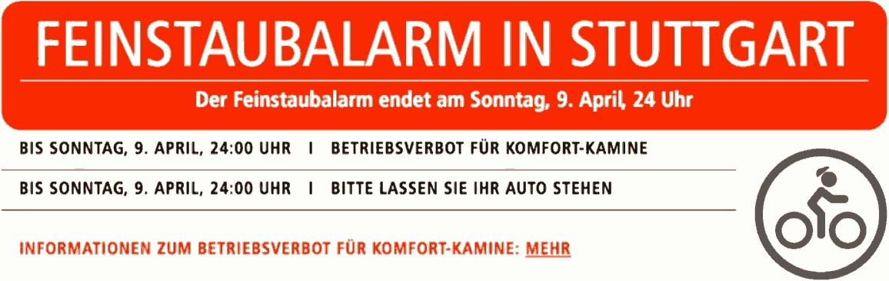
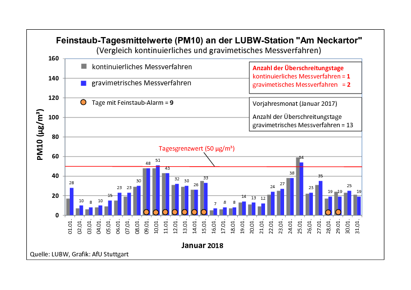
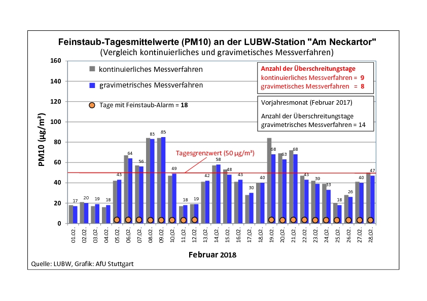
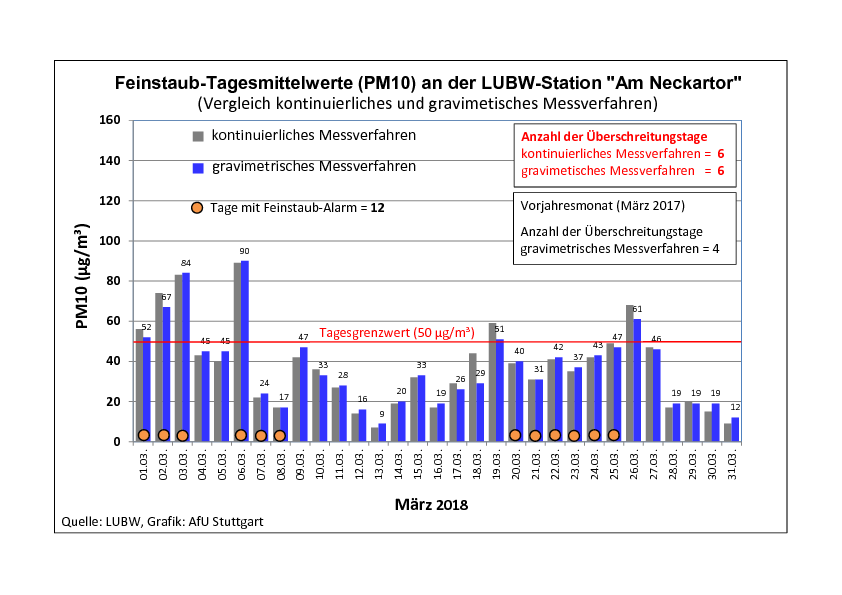
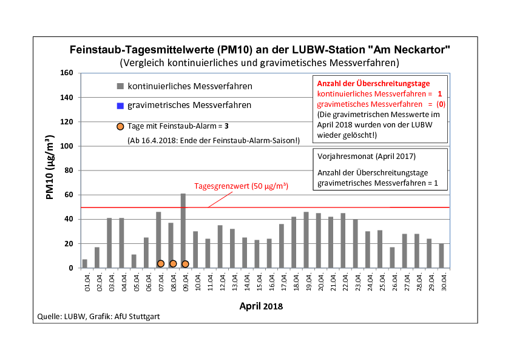
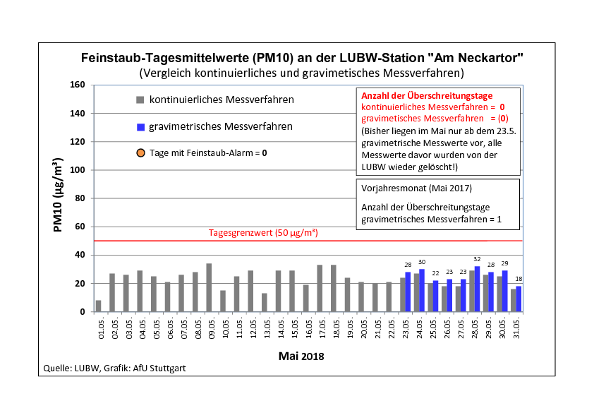
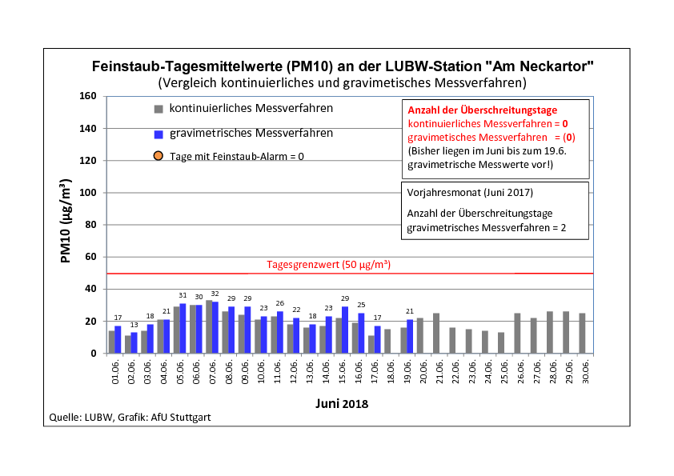
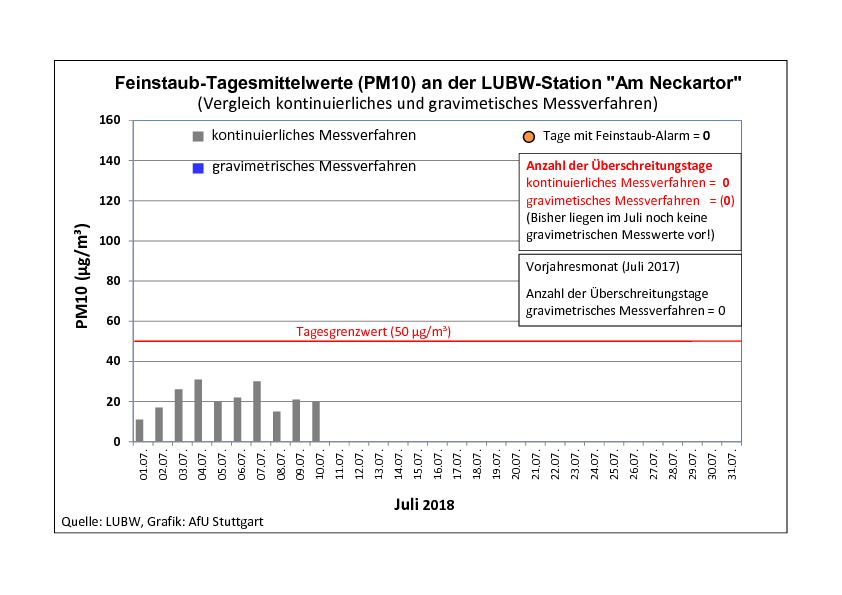

% Feinstaub-Sensor Workshop
% OK-Lab S/KA
% 2018-09-02

# Feinstaub

## Quellen

* Verkehr (Abgase, Abrieb Reifen/Bremsen, Aufwirbelung)
* Heizung, Öfen, Abfallverbrennungsanlagen
* Schüttgutumschlag, Baustellen
* natürliche Quellen
* Landwirtschaft (Tierhaltung)
* Industrieprozesse

<!--* primäre Feinstäube (z.B. Verbrennungsprozess)
* sekundäre Feinstäube (z.B. chemische Reaktionen)-->

---

## S-Neckartor 2018

](images/feinstaubwerte_2018-00.png)

---

](images/feinstaubwerte_2018-01.png)

---

](images/feinstaubwerte_2018-02.png)

---

](images/feinstaubwerte_2018-03.png)

---

](images/feinstaubwerte_2018-04.png)

---

](images/feinstaubwerte_2018-05.png)

---

](images/feinstaubwerte_2018-06.png)

---

](images/feinstaubwerte_2018-07.png)

## Feinstaubalarm Stuttgart

* [Diesel-Fahrverbote in Stuttgart ab Jahresbeginn 2019](https://www.heise.de/newsticker/meldung/Diesel-Fahrverbote-in-Stuttgart-ab-Jahresbeginn-2019-4107978.html)
11.07.2018 14:16 Uhr

# Das Projekt

## luftdaten.info

* besteht seit 2016
* "Geburtshelfer"
    * Freiwillige mit Interesse an Technik im [shackspace](https://shackspace.de/)
    * [Station Neckartor](http://mnz.lubw.baden-wuerttemberg.de/messwerte/aktuell/spotstatDEBW118.htm)
    * [Stuttgart](https://www.stuttgart.de/)
    * [OK Lab Stuttgart](https://codefor.de/stuttgart/), Termine via [Meetup](https://www.meetup.com/de-DE/OK-Lab-Stuttgart-Meet-Up/)
* [feinstaubalarm.stuttgart.de](http://feinstaubalarm.stuttgart.de/), [Erklärvideo](https://www.youtube.com/watch?v=LsGAXkiNZ1Q)

---

## Open Knowledge Foundation

> offenes Wissen, offene Daten, Transparenz und Beteiligung

* [Code for America .org](https://codeforamerica.org)
* [Open Knowledge Foundation Deutschland okfn.de](https://okfn.de/)
* [codefor.de](https://codefor.de/)

---

## OK Lab Stuttgart

* [OK Lab Stuttgart](https://codefor.de/stuttgart/), Termine via [Meetup](https://www.meetup.com/de-DE/OK-Lab-Stuttgart-Meet-Up/)
* [luftdaten.info](https://luftdaten.info/)
* (http://deutschland.maps.luftdaten.info/]()
* [Bauanleitung Sensor](https://luftdaten.info/feinstaubsensor-bauen/)
* [github.com/opendata-stuttgart](https://github.com/opendata-stuttgart)

# Feinstaubsensor Station bauen{.allowframebreaks}

## Station bauen

* [Aktuelle Bauanleitung Sensor](https://luftdaten.info/feinstaubsensor-bauen/)

{width=50%}

## Graphen

* Sensordaten: [www.madavi.de/sensor/graph.php](http://www.madavi.de/sensor/graph.php)
* WLAN-Signal: [www.madavi.de/sensor/signal.php](http://www.madavi.de/sensor/signal.php)

---

## WLAN Konfigurationsseite(n)

* [feinstaubsensor-ID.local](http://feinstaubsensor-ID.local/)

---

---

---

---

---

---

## LETZTE SCHRITTE

Damit der Sensor Teil des Netzwerkes wird, brauchen wir noch einige Angaben.
Fülle dazu einfach das Formular auf [luftdaten.info/feinstaubsensor-bauen/](https://luftdaten.info/feinstaubsensor-bauen/) aus.

* deine ID des ESP8266 (NodeMCU) –> kommt als Nummer im WLAN (Feinstaubsensor-…) oder auf der Konfigurationsseite oben
* deine Emailadresse (wird nicht veröffentlicht)
* deine Adresse: Strasse mit Hausnummer, PLZ und Ort –> wir machen daraus deine Koordinaten (werden nur gerundet herausgegeben)
* die Umgebung der Station – z. B. Höhe über Grund, Strassenseite, hohes Verkehrsaufkommen, freies Feld oder ähnliches

<!--
* ChipID (Pflichtfeld)
* Deine E-Mail-Adresse (Pflichtfeld)
* Strasse und Hausnummer
* PLZ und Ort
* Land
* Höhe über Grund/Strasse
* Hausseite (Strasse/strassenabgewandt/seitlich)
* Beschreibung (Verkehr, Quellen für Luftverschmutzung, …)
-->

## Links

* [Vortrag Frank Riedel](https://vimeo.com/257288126)

# Appendix

## All imgs

---

{width=50%}

---

---

---

---

---

---

---

---

---

---

{width=50%}

---

{width=50%}

---

{width=50%}

---

---

---

---

---

---

---

---

---

---

{width=50%}

---

---

---

---

---

---

---

---

