**Feinstaubsensor Bauanleitung Kurzversion**

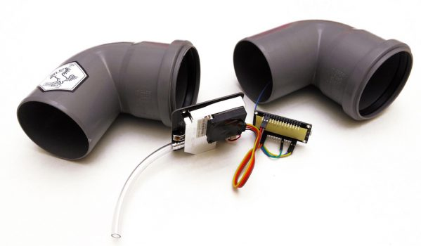\
Bausatz \
SDS011, NodeMCU, DHT22\
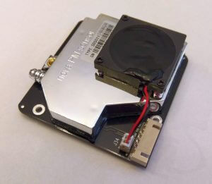{width=50%}
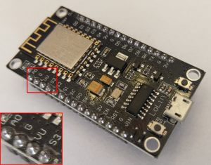{width=30%}
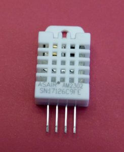{width=15%}\

**weitere Sensoren** (s. FAQ)

BMP180, BMP280 und BME280 werden per I2C (serieller Bus, mehrere Komponenten teilen sich die gleichen Anschluß-Pins, Beschreibung auf Wikipedia) angeschlossen:

* VCC	->	Pin 3V3
* GND	->	Pin GND
* SCL	->	Pin D4 (GPIO2)
* SDA	->	Pin D3 (GPIO0)

Nach den Anschließen müssen die Sensoren noch in der Konfiguration aktiviert werden. Danach ist ein Neustart notwendig, da die Sensoren beim Starten entsprechend initialisiert werden müssen.

<!--
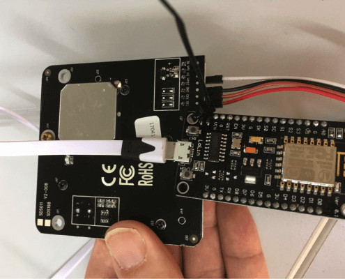{width=30%}

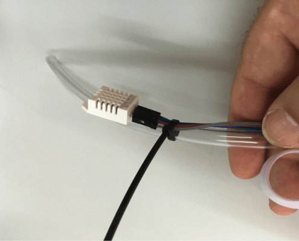{width=50%}

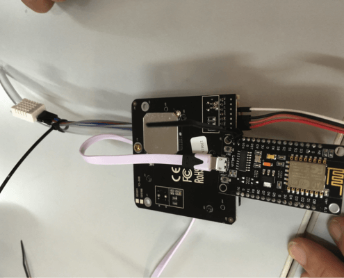{width=50%}

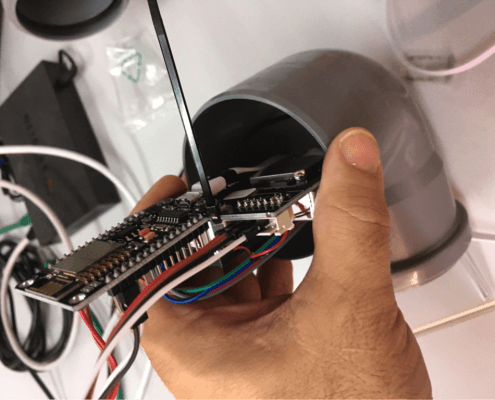{width=30%}

-->

<!--

{width=50%}

---

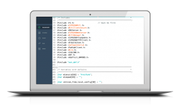{width=50%}

---

{width=50%}

---

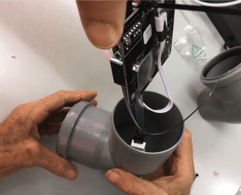{width=50%}

---

{width=50%}

---

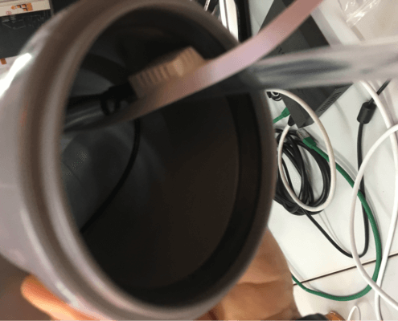{width=50%}

---

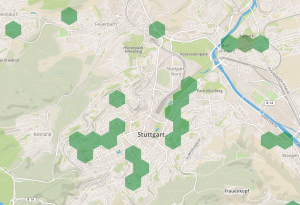{width=50%}

---

{width=50%}

---

{width=50%}

---

{width=50%}

---

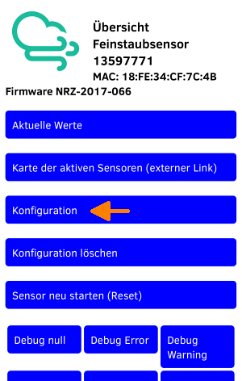{width=50%}

---

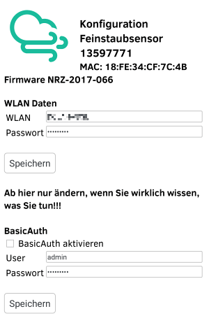{width=50%}

---

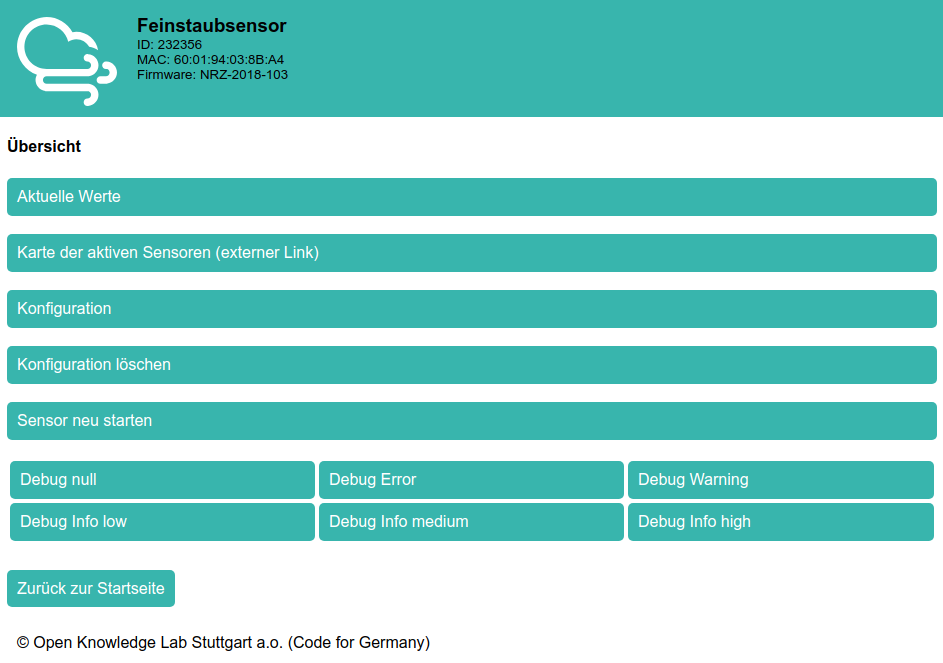{width=50%}

---

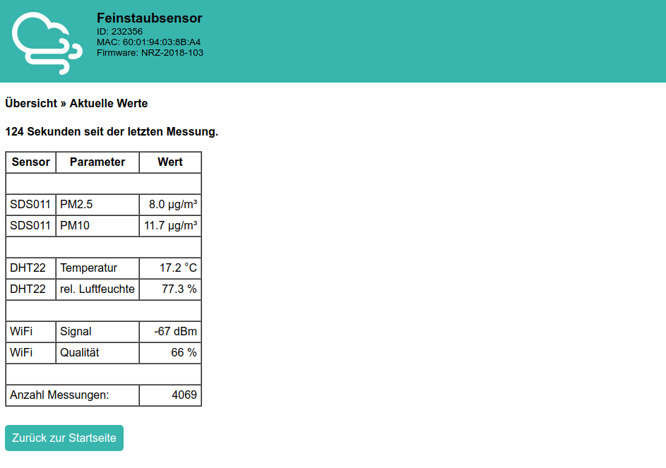{width=50%}

---

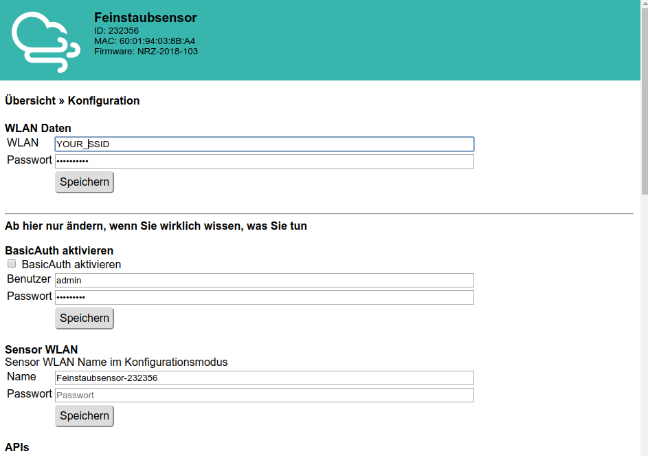{width=50%}

---

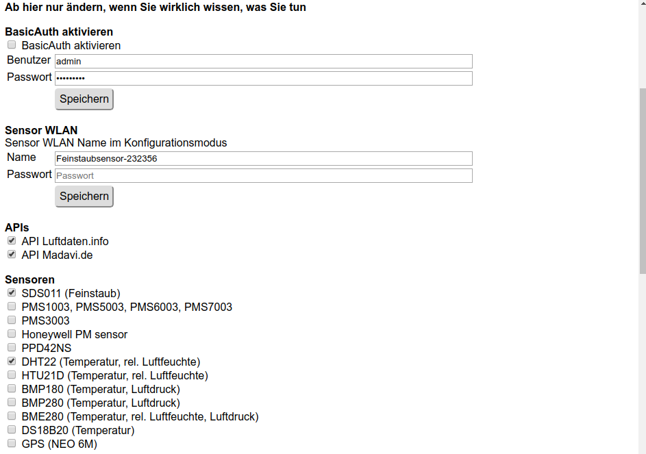{width=50%}

---

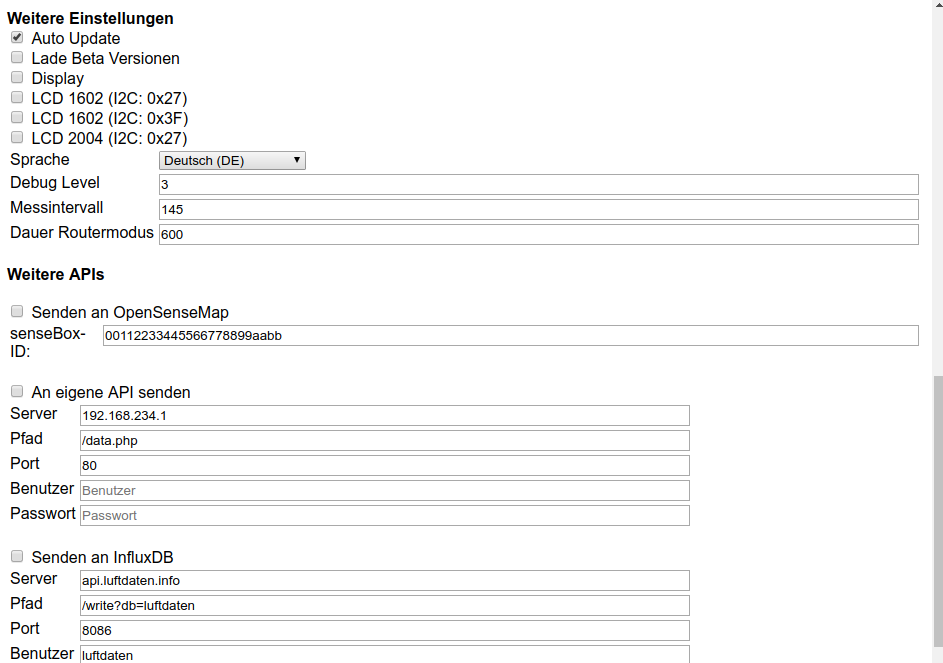{width=50%}

---
-->
